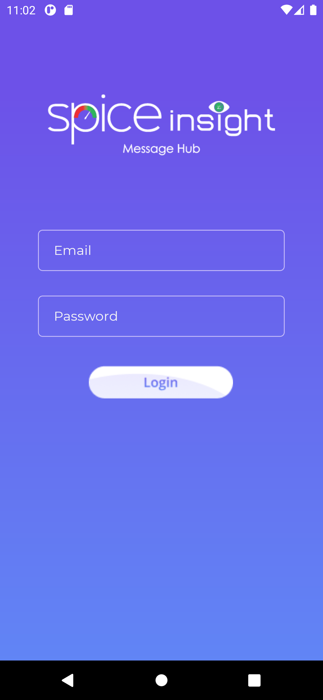
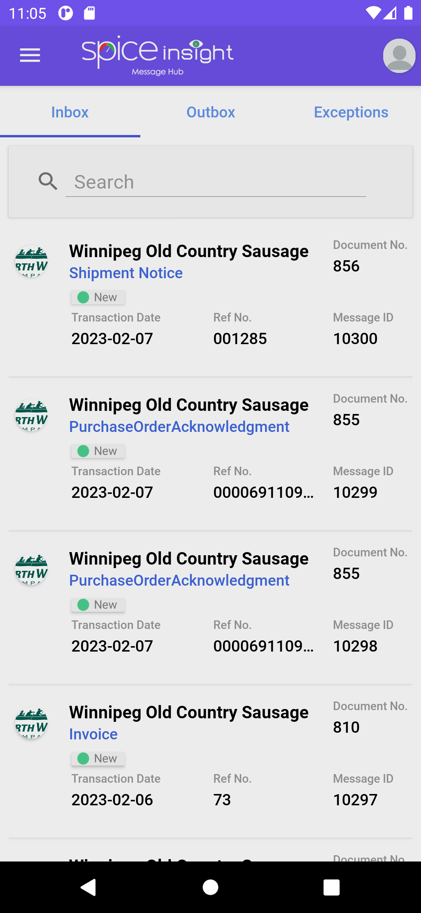
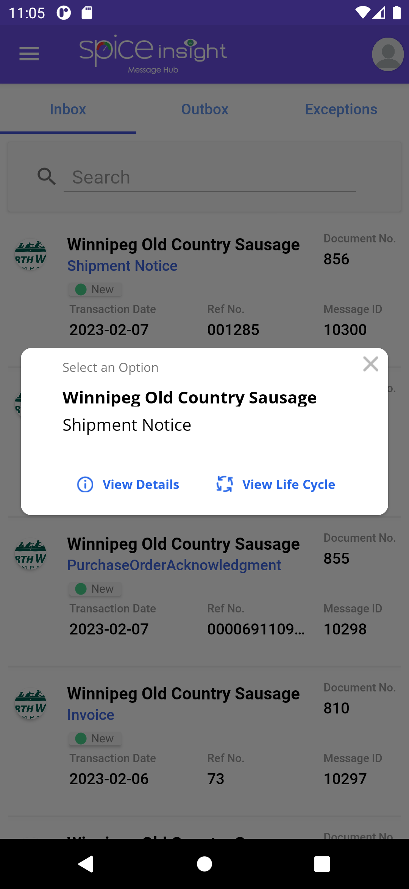
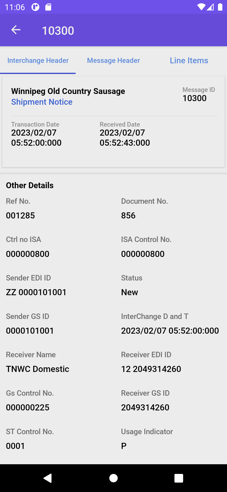

# MobileDemo
Mobile application made during Co-Op with Spice Technology Group. This application brings Spice's already existing website portal to a mobile environment using their 
existing APIs. Here users can login to their account, view their documents and see more details about them in an organized manner. The application will be available on the
Google Play Store later this year. Created in Xamarin Forms entirely by Luke Jackson.

  

    
  

  

    
  

  

    
  

  

    
  

